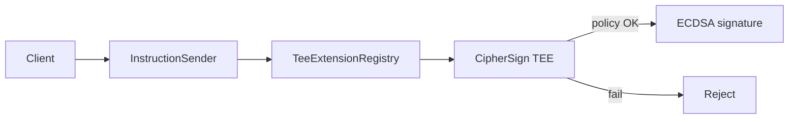
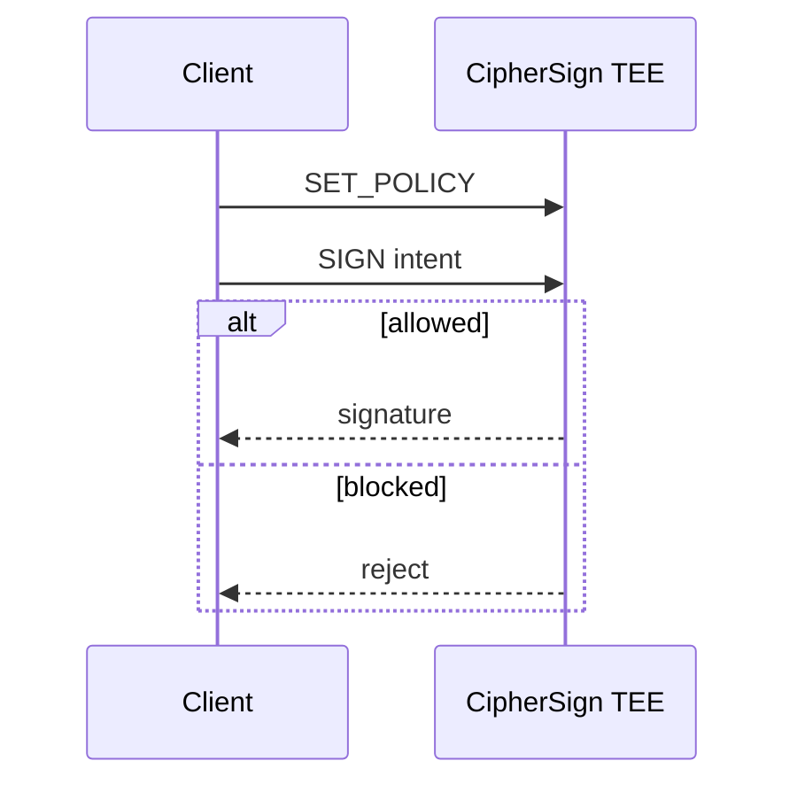

<p align="center">
  
</p>

<h1 align="center">CipherSign</h1>

<p align="center">
  Confidential signing on Flare.<br/>
  Keys stay in a TEE. Signatures only release when policy says yes.
</p>

<p align="center">
  <a href="https://cipher-sign.vercel.app"></a>
  
  
</p>

---

## Product

Hot wallets sign anything. CipherSign only signs under a locked policy:

- allowed recipient  
- max amount  
- expiry  

Policy is enforced **inside an attested Flare TEE** — not a mutable backend.

**Try it:** [cipher-sign.vercel.app](https://cipher-sign.vercel.app)

---

## Architecture





---

## Coston2

| | |
|---|---|
| InstructionSender | [`0x79bB3e509B6a0f43d506a761Fb022221c3FF0Ee9`](https://coston2-explorer.flare.network/address/0x79bB3e509B6a0f43d506a761Fb022221c3FF0Ee9) |
| EXTENSION_ID | `0x…0665` |
| Deployer | `0xc73Be03499616FFaA79315673e620AACfbb920C4` |

---

## Built for Bounty 2

| | |
|---|---|
| Useful | Agent payroll / OTC / treasury without hot keys |
| Flare-native | InstructionSender → registry → TEE extension |
| New work | `SET_POLICY` + gated `SIGN` + product UI |
| Evidence | 28/28 tests · Coston2 deploy · live demo |

Docs: [Architecture](docs/ARCHITECTURE.md) · [Submission](docs/SUBMISSION.md) · [Setup](docs/SETUP.md)

```bash
cd web && npm ci && npm run dev
cd tee/typescript && npm test
```

## License

MIT — see [LICENSE](LICENSE). Upstream FCC scaffold © Flare Foundation.
