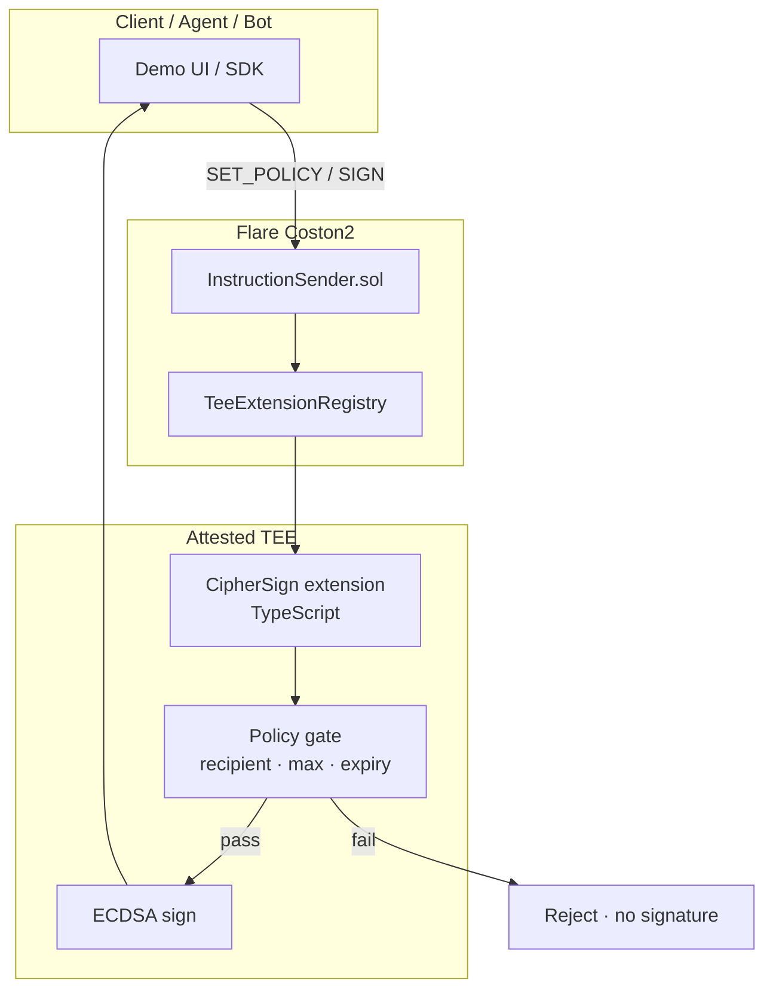
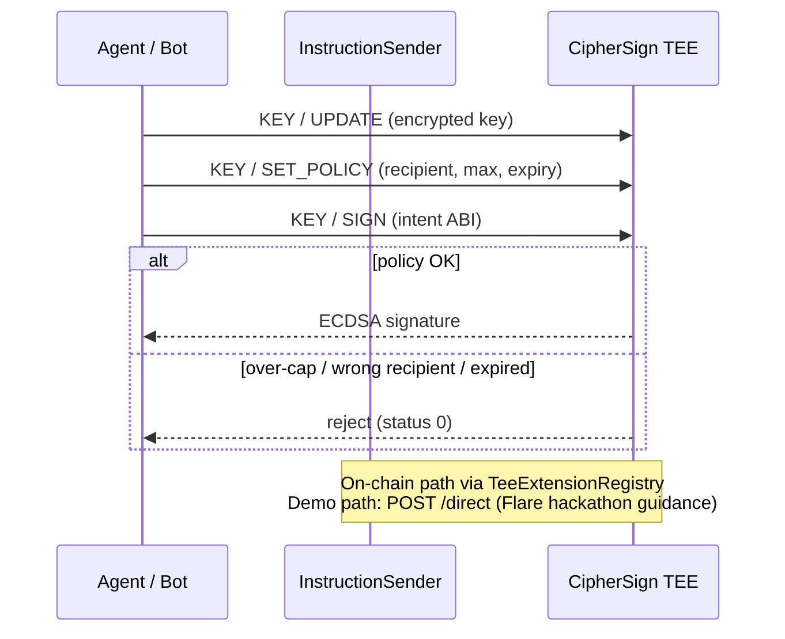
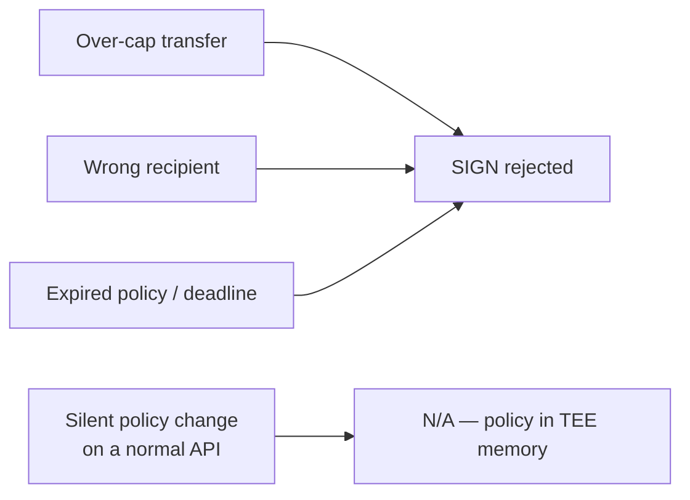

<p align="center">
  
</p>

<h1 align="center">CipherSign</h1>

<p align="center">
  <strong>Policy-gated confidential signing on Flare Confidential Compute</strong><br/>
  Keys stay in a TEE. Signatures only release when policy says yes.
</p>

<p align="center">
  <a href="https://cipher-sign.vercel.app"></a>
  <a href="https://coston2-explorer.flare.network/address/0x79bB3e509B6a0f43d506a761Fb022221c3FF0Ee9"></a>
</p>

<p align="center">
  
  
  
  
</p>

---

## Why CipherSign

| Without CipherSign | With CipherSign |
|---|---|
| Hot wallet / bot key signs **anything** | Vault signs **only** allowed recipient + amount + expiry |
| Policy lives in a mutable backend | Policy enforced **inside the attested TEE** |
| Compromise = full drain | Over-cap / wrong recipient → **rejected in enclave** |

Built for **agent payroll**, **OTC escrow**, and **treasury bots** that must prove: *this key only signs under rules X*.

**Live product:** [cipher-sign.vercel.app](https://cipher-sign.vercel.app) · **Repo docs:** [Architecture](docs/ARCHITECTURE.md) · [Submission](docs/SUBMISSION.md) · [Win checklist](docs/WIN_CHECKLIST.md)

---

## Architecture

### End-to-end trust path



### Op flow (product logic)



### Threat model (what we stop)



---

## Why this wins Bounty 2

| Judge lens | CipherSign score |
|---|---|
| **Useful product** | Real problem: agent / bot / payroll keys that must not be hot wallets |
| **Flare-native** | `InstructionSender` → `TeeExtensionRegistry` → CipherSign extension in TEE |
| **Technical depth** | New `SET_POLICY` op + ABI intent checks + ECDSA only after gate |
| **Evidence** | 28/28 unit tests · Coston2 contract · live demo UI |
| **Future** | Agent SDK · multi-recipient · PMW / XRPL outbound when FCC matures |

This is **not** a “privacy DB” wrapper. Removing Flare removes the **attested TEE + registry** trust model.

---

## Proof on Coston2

| Item | Value |
|------|-------|
| Network | Flare Testnet Coston2 (`114`) |
| InstructionSender | [`0x79bB3e509B6a0f43d506a761Fb022221c3FF0Ee9`](https://coston2-explorer.flare.network/address/0x79bB3e509B6a0f43d506a761Fb022221c3FF0Ee9) |
| EXTENSION_ID | `0x0000000000000000000000000000000000000000000000000000000000000665` |
| Deployer | `0xc73Be03499616FFaA79315673e620AACfbb920C4` |
| Tests | `cd tee/typescript && npm test` → **28/28 pass** |
| Live demo | https://cipher-sign.vercel.app |

---

## What we built (new work)

On top of Flare’s `fce-direct-sign` scaffold:

1. **`KEY/SET_POLICY`** — ABI `(address, uint256 maxAmount, uint256 expiresAt)`
2. **Gated `KEY/SIGN`** — rejects wrong recipient, over-cap, expired policy/intent
3. **Product demo UI** — same policy rules as TEE; live `POST /direct` when FCC is up
4. **Judge pack** — architecture, Loom script, DoraHacks submission, feedback loop

---

## Try it (2 minutes)

**Online:** open [cipher-sign.vercel.app](https://cipher-sign.vercel.app)

1. Pick a scenario (payroll / OTC / treasury)  
2. **Lock policy**  
3. **Request signature** → pass  
4. **Try over-cap attack** → reject  

**Local:**

```bash
cd web && npm ci && npm run dev
```

Extension tests:

```bash
cd tee/typescript && npm test
```

---

## Repo layout

```
cipher-sign/
├── web/                 # Product demo (Vite) → Vercel
├── tee/typescript/      # CipherSign TEE handlers
├── tee/contract/        # InstructionSender.sol
├── tee/scripts/         # FCC full-setup helpers
└── docs/                # Architecture · submission · checklist
```

Full local TEE stack: [docs/SETUP.md](docs/SETUP.md) — use **`develop`** for `tee-proxy` / `tee-node`.

---

## Status

Flare is refreshing FCC on Coston2. Product policy logic, UI, tests, and Coston2 `InstructionSender` are shipped. Demo mode uses the **same policy rules** as the TEE extension so judges and testers can evaluate now; live `/direct` plugs in when `develop` is stable.

---

## License

MIT — see [LICENSE](LICENSE). Upstream FCC scaffold portions © Flare Foundation.
