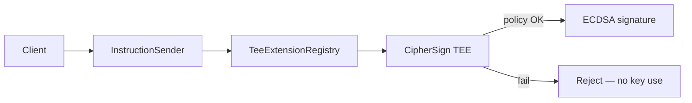
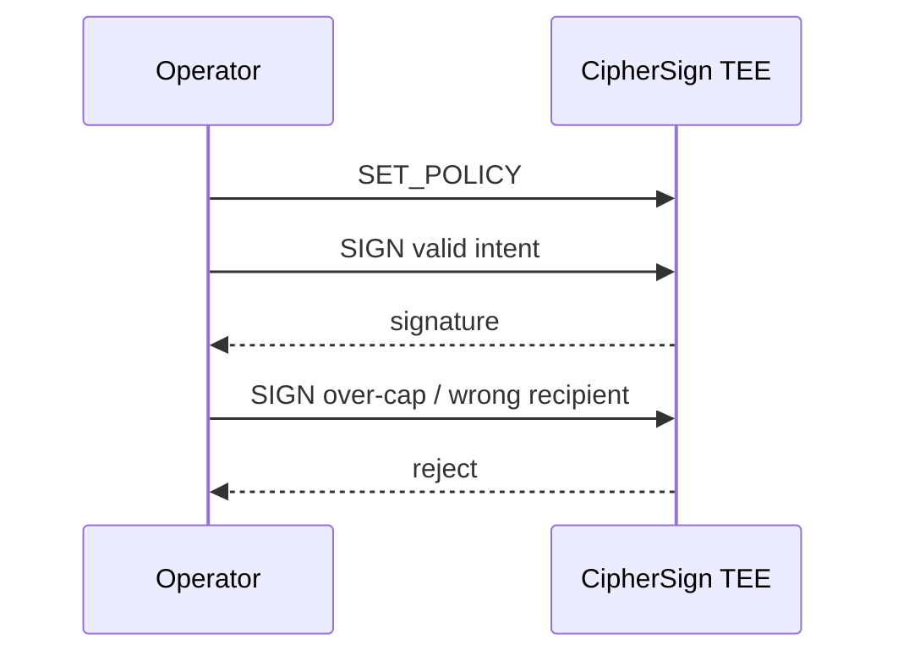

<p align="center">
  
</p>

<h1 align="center">CipherSign</h1>

<p align="center">
  <em>Flare · Confidential Compute</em><br/>
  <strong>Payouts that cannot overspend.</strong>
</p>

<p align="center">
  Policy-gated signing for FAssets executors, Flare bots, and FTSO forwarders.<br/>
  Keys stay in a TEE. Allowlist, cap, and expiry are enforced in the enclave.
</p>

<p align="center">
  <a href="https://cipher-sign.vercel.app"><strong>Open live product →</strong></a>
  &nbsp;·&nbsp;
  <a href="https://dorahacks.io/buidl/47182/">DoraHacks</a>
  &nbsp;·&nbsp;
  <a href="https://github.com/thesithunyein/cipher-sign">GitHub</a>
</p>

<br/>

<!-- Same link bar as the live app -->
<table align="center" width="100%">
  <tr>
    <td align="center" width="33%">
      <sub>NETWORK</sub><br/>
      <a href="https://coston2-explorer.flare.network/address/0x79bB3e509B6a0f43d506a761Fb022221c3FF0Ee9"><strong>Coston2</strong></a><br/>
      <code>InstructionSender</code>
    </td>
    <td align="center" width="33%">
      <sub>SOURCE</sub><br/>
      <a href="https://github.com/thesithunyein/cipher-sign"><strong>GitHub</strong></a><br/>
      <code>29 / 29 tests</code>
    </td>
    <td align="center" width="33%">
      <sub>SUBMISSION</sub><br/>
      <a href="https://dorahacks.io/buidl/47182/"><strong>DoraHacks</strong></a><br/>
      <code>Bounty 2</code>
    </td>
  </tr>
</table>

<p align="center">
  <a href="https://cipher-sign.vercel.app">
    
  </a>
</p>

<p align="center">
  
  
  
</p>

---

## The product

A hot wallet signs anything you ask. That is fine for demos — and fatal for payout automation.

**CipherSign** holds the key inside a Flare TEE. Every signature request is gated by a locked policy **in the enclave**, not in a mutable backend:

| Rule | What it stops |
|------|----------------|
| **Allowlist** | Payments to unknown recipients |
| **Max amount** | Overspend / drain |
| **Expiry** | Forever-valid keys |

Break the rules → **no signature**. Period.

### Built for Flare operators today

| Mode | Job |
|------|-----|
| **FAssets** | Executor fee vault — fixed fee recipient + hard cap |
| **Bot** | Keeper / automation payouts without a drainable hot key |
| **FTSO** | Reward forwarder locked to one payout address |

---

## Try it (60 seconds)

1. Open **[cipher-sign.vercel.app](https://cipher-sign.vercel.app)** — badge should read **Live TEE** when the operator node is up  
2. Pick **FAssets / Bot / FTSO**  
3. **Lock policy** → **Sign** a valid payout  
4. Hit **Overspend** or **Wrong addr** — the vault refuses  

If Live is offline, **Preview** still runs the same allowlist / cap / expiry rules so the product never goes dark for judges.

---

## How it uses Flare


```mermaid
flowchart LR
  A[Client] --> B[InstructionSender]
  B --> C[TeeExtensionRegistry]
  C --> D[CipherSign TEE]
  D -->|policy OK| E[ECDSA signature]
  D -->|fail| F[Reject — no key use]
```

Inside the enclave:

1. `KEY / UPDATE` — create the signing key  
2. `KEY / SET_POLICY` — lock allowlist, max amount, expiry  
3. `KEY / SIGN` — release ECDSA only if the intent passes  


```mermaid
sequenceDiagram
  participant Ops as Operator
  participant TEE as CipherSign TEE
  Ops->>TEE: SET_POLICY
  Ops->>TEE: SIGN valid intent
  TEE-->>Ops: signature
  Ops->>TEE: SIGN over-cap / wrong recipient
  TEE-->>Ops: reject
```

---

## On-chain proof (Coston2)

| | |
|---|---|
| Network | Flare Testnet Coston2 (`114`) |
| InstructionSender | [`0x79bB3e509B6a0f43d506a761Fb022221c3FF0Ee9`](https://coston2-explorer.flare.network/address/0x79bB3e509B6a0f43d506a761Fb022221c3FF0Ee9) |
| EXTENSION_ID | `0x…0665` |
| Deployer | `0xc73Be03499616FFaA79315673e620AACfbb920C4` |

---

## Why this wins Bounty 2

| Criterion | CipherSign |
|-----------|------------|
| **Useful** | Real Flare jobs — FAssets fees, bots, FTSO forwarders |
| **Flare-native** | InstructionSender → registry → attested TEE extension |
| **Technical** | Policy-gated `SIGN`, 29/29 tests, attack buttons that fail closed |
| **New work** | Allowlist model + Live product UI — not Hello World |
| **Clarity** | One live URL, one vault, one story |

```bash
cd web && npm ci && npm run dev          # product UI
cd tee/typescript && npm test            # 29/29
```

Docs: [Architecture](docs/ARCHITECTURE.md) · [Setup](docs/SETUP.md) · [Demo script](docs/DEMO_SCRIPT.md) · [Submission](docs/SUBMISSION.md)

---

## Layout

```text
web/                 Live product — FAssets / Bot / FTSO vault
tee/typescript/      TEE extension — UPDATE · SET_POLICY · SIGN
tee/contract/        InstructionSender (Coston2)
docs/                Architecture · setup · submission pack
```

`tee/go`, `tee/python`, and `tee/skills` are upstream Flare FCC scaffold.

---

## License

MIT — [LICENSE](LICENSE). Upstream FCC scaffold © Flare Foundation.
