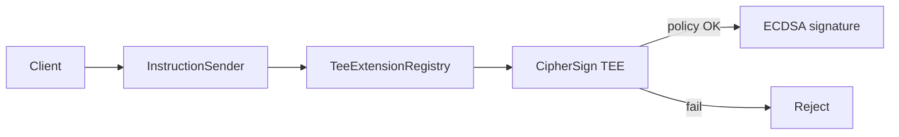
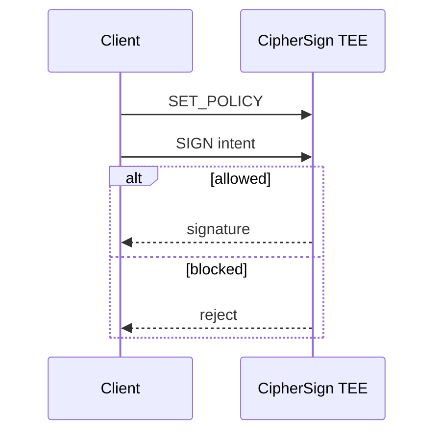

<p align="center">
  
</p>

<h1 align="center">CipherSign</h1>

<p align="center">
  Confidential signing on Flare.<br/>
  Keys stay in a TEE. Signatures only release when policy says yes.
</p>

<p align="center">
  <a href="https://cipher-sign.vercel.app"></a>
  
  
</p>

---

## Product

Hot wallets sign anything. CipherSign only signs under a locked policy:

- allowlist (up to 5 recipients)
- max amount
- expiry

Built for **Flare-today users**: FAssets executor fees, keeper/bot payouts, and FTSO reward forwarding — not generic payroll.

Policy is enforced **inside an attested Flare TEE**, not a mutable backend.

**Try it:** [cipher-sign.vercel.app](https://cipher-sign.vercel.app) · [live TEE video](https://youtu.be/ZQVAkcT0Z08) · [BUIDL](https://dorahacks.io/buidl/47182/)

Judges: Vercel = policy UX (Preview). Live FCC `/direct` proof = video + `npm run live:smoke`.

---

## Architecture


```mermaid
flowchart LR
  A[Client] --> B[InstructionSender]
  B --> C[TeeExtensionRegistry]
  C --> D[CipherSign TEE]
  D -->|policy OK| E[ECDSA signature]
  D -->|fail| F[Reject]
```


```mermaid
sequenceDiagram
  participant C as Client
  participant T as CipherSign TEE
  C->>T: SET_POLICY
  C->>T: SIGN intent
  alt allowed
    T-->>C: signature
  else blocked
    T-->>C: reject
  end
```

---

## Coston2

| | |
|---|---|
| InstructionSender | [`0x79bB3e509B6a0f43d506a761Fb022221c3FF0Ee9`](https://coston2-explorer.flare.network/address/0x79bB3e509B6a0f43d506a761Fb022221c3FF0Ee9) |
| EXTENSION_ID | `0x…0665` |
| Deployer | `0xc73Be03499616FFaA79315673e620AACfbb920C4` |

---

## Built for Bounty 2

| | |
|---|---|
| Useful | FAssets fees / Flare bots / FTSO forwarders without hot keys |
| Flare-native | InstructionSender → registry → TEE extension |
| New work | Allowlist + gated `SIGN` + Flare-native product UI |
| Evidence | 29/29 tests · Coston2 deploy · Preview app · live TEE video |

Docs: [Architecture](docs/ARCHITECTURE.md) · [Submission](docs/SUBMISSION.md) · [Setup](docs/SETUP.md)

```bash
cd web && npm ci && npm run dev
cd tee/typescript && npm test
```

---

## Project structure

```text
cipher-sign/
├── .github/
│   └── workflows/
│       └── build-demo.yml
├── docs/
│   ├── ARCHITECTURE.md
│   ├── CREATE_REPO.md
│   ├── DEMO_SCRIPT.md
│   ├── FEEDBACK.md
│   ├── PROGRESS.md
│   ├── SETUP.md
│   ├── SUBMISSION.md
│   ├── TELEGRAM_DB_FOLLOWUP.md
│   ├── TELEGRAM_DEVELOP_ACK.md
│   ├── TELEGRAM_INDEXER_REQUEST.md
│   ├── TELEGRAM_SIGNATURE_ERROR.md
│   ├── WIN_CHECKLIST.md
│   ├── WIN_PATH.md
│   ├── check-ready.ps1
│   ├── ciphersign-logo-480.png
│   ├── ciphersign-logo-480.svg
│   └── logo.svg
├── scripts/
├── tee/
│   ├── .env.example
│   ├── .gitignore
│   ├── README.md
│   ├── docker-compose.yaml
│   ├── config/
│   │   ├── extension.env
│   │   ├── coston2/
│   │   │   └── deployed-addresses.json
│   │   └── proxy/
│   │       ├── extension_proxy.toml.example
│   │       ├── extension_proxy.coston2.toml.example
│   │       └── extension_proxy.coston2.docker.toml.example
│   ├── contract/
│   │   ├── InstructionSender.sol
│   │   ├── foundry.toml
│   │   └── interface/
│   │       ├── ITeeExtensionRegistry.sol
│   │       └── ITeeMachineRegistry.sol
│   ├── proxy/
│   │   └── Dockerfile
│   ├── scripts/
│   │   ├── full-setup.sh
│   │   ├── generate-bindings.sh
│   │   ├── pre-build.sh
│   │   ├── post-build.sh
│   │   ├── start-services.sh
│   │   ├── stop-services.sh
│   │   ├── test.sh
│   │   └── test-direct.sh
│   ├── go/                          # upstream FCC Go scaffold
│   ├── python/                      # upstream FCC Python scaffold
│   ├── skills/                      # upstream create-extension skill
│   └── typescript/                  # CipherSign TEE extension (primary)
│       ├── Dockerfile
│       ├── README.md
│       ├── package.json
│       ├── package-lock.json
│       ├── tsconfig.json
│       ├── vitest.config.ts
│       └── src/
│           ├── main.ts
│           ├── app/
│           │   ├── abi.ts
│           │   ├── config.ts
│           │   ├── crypto.ts
│           │   └── handlers.ts      # KEY/UPDATE, SET_POLICY, SIGN
│           ├── base/
│           │   ├── crypto.ts
│           │   ├── encoding.ts
│           │   ├── server.ts
│           │   └── types.ts
│           └── __tests__/
│               ├── abi.test.ts
│               ├── base-crypto.test.ts
│               ├── crypto.test.ts
│               ├── encoding.test.ts
│               └── handlers.test.ts
├── web/
│   ├── .env.example
│   ├── .gitignore
│   ├── index.html
│   ├── live-direct-smoke.mjs
│   ├── package.json
│   ├── package-lock.json
│   ├── tsconfig.json
│   ├── vercel.json
│   ├── vite.config.ts
│   ├── public/
│   │   ├── favicon.svg
│   │   └── logo.svg
│   └── src/
│       ├── fcc.ts
│       ├── main.ts
│       ├── style.css
│       └── assets/
├── .gitignore
├── LICENSE
├── README.md
└── vercel.json
```

Product code paths: **`web/`** (UI) and **`tee/typescript/`** (policy-gated signer). `tee/go`, `tee/python`, and `tee/skills` are upstream Flare FCC scaffold.

---

## License

MIT — see [LICENSE](LICENSE). Upstream FCC scaffold © Flare Foundation.
