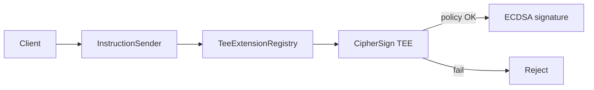
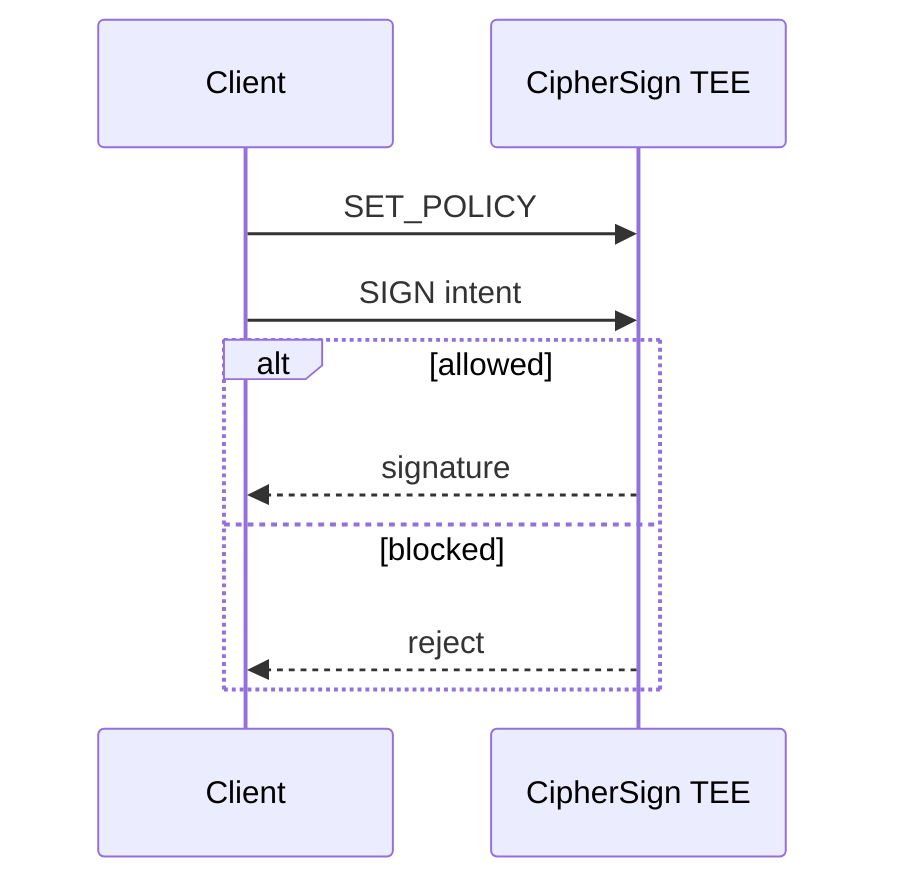

<p align="center">
  
</p>

<h1 align="center">CipherSign</h1>

<p align="center">
  <strong>Payouts that cannot overspend.</strong><br/>
  Policy-gated confidential signing on Flare.<br/>
  Keys stay in a TEE. Signatures only release when allowlist, cap, and expiry say yes.
</p>

<p align="center">
  <a href="https://cipher-sign.vercel.app"></a>
  <a href="https://dorahacks.io/buidl/47182/"></a>
  
  
</p>

<p align="center">
  <a href="https://cipher-sign.vercel.app">App</a> ·
  <a href="https://dorahacks.io/buidl/47182/">BUIDL</a> ·
  <a href="https://coston2-explorer.flare.network/address/0x79bB3e509B6a0f43d506a761Fb022221c3FF0Ee9">Coston2</a> ·
  <a href="docs/SUBMISSION.md">Submission</a>
</p>

---

## Product

Hot wallets sign anything. CipherSign only signs under a locked policy:

- allowlist (up to 5 recipients)
- max amount
- expiry

Built for **Flare-today operators**: FAssets executor fees, keeper/bot payouts, and FTSO reward forwarding.

Policy is enforced **inside an attested Flare TEE**, not a mutable backend.

| Mode | What judges see |
|------|-----------------|
| **Live TEE** | Hosted app hits FCC `/direct` when the operator tunnel is up |
| **Preview** | Same allowlist / cap / expiry rules in-browser if Live is offline |

---

## Architecture


```mermaid
flowchart LR
  A[Client] --> B[InstructionSender]
  B --> C[TeeExtensionRegistry]
  C --> D[CipherSign TEE]
  D -->|policy OK| E[ECDSA signature]
  D -->|fail| F[Reject]
```


```mermaid
sequenceDiagram
  participant C as Client
  participant T as CipherSign TEE
  C->>T: SET_POLICY
  C->>T: SIGN intent
  alt allowed
    T-->>C: signature
  else blocked
    T-->>C: reject
  end
```

---

## Coston2

| | |
|---|---|
| InstructionSender | [`0x79bB3e509B6a0f43d506a761Fb022221c3FF0Ee9`](https://coston2-explorer.flare.network/address/0x79bB3e509B6a0f43d506a761Fb022221c3FF0Ee9) |
| EXTENSION_ID | `0x…0665` |
| Deployer | `0xc73Be03499616FFaA79315673e620AACfbb920C4` |

---

## Bounty 2 — Confidential Compute

| Lens | CipherSign |
|------|------------|
| Useful | FAssets fees / Flare bots / FTSO forwarders without drainable hot keys |
| Flare-native | InstructionSender → registry → TEE extension |
| New work | Allowlist policy + gated `SIGN` + Flare product UI |
| Evidence | 29/29 tests · Coston2 deploy · Live / Preview app |

```bash
cd web && npm ci && npm run dev
cd tee/typescript && npm test
```

Docs: [Architecture](docs/ARCHITECTURE.md) · [Submission](docs/SUBMISSION.md) · [Setup](docs/SETUP.md) · [Demo script](docs/DEMO_SCRIPT.md)

---

## Layout

```text
cipher-sign/
├── docs/                 # Architecture, submission, setup, demo script
├── tee/typescript/       # Policy-gated TEE extension (KEY/UPDATE, SET_POLICY, SIGN)
├── tee/contract/         # InstructionSender (Coston2)
├── web/                  # Product UI (FAssets / Bot / FTSO)
└── README.md
```

Product code: **`web/`** + **`tee/typescript/`**. `tee/go`, `tee/python`, and `tee/skills` are upstream Flare FCC scaffold.

---

## License

MIT — see [LICENSE](LICENSE). Upstream FCC scaffold © Flare Foundation.
