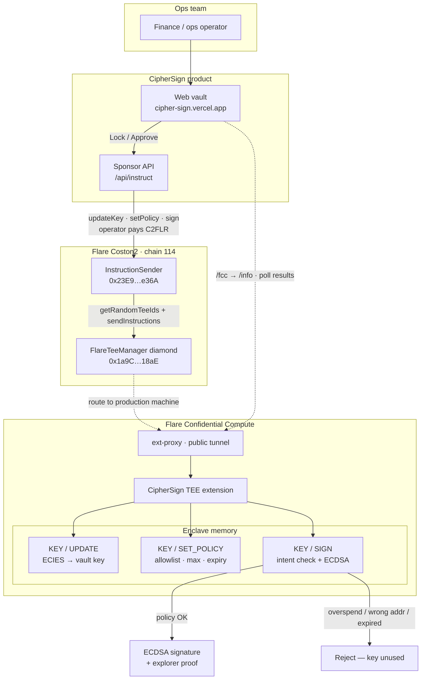
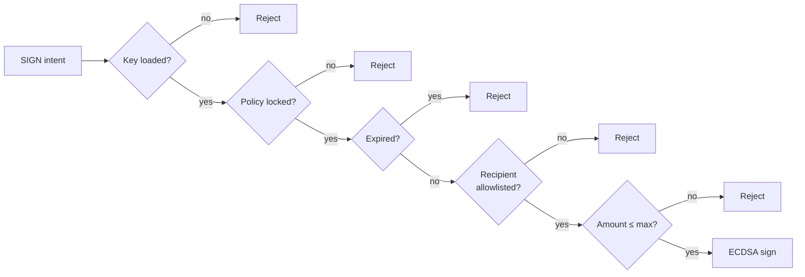
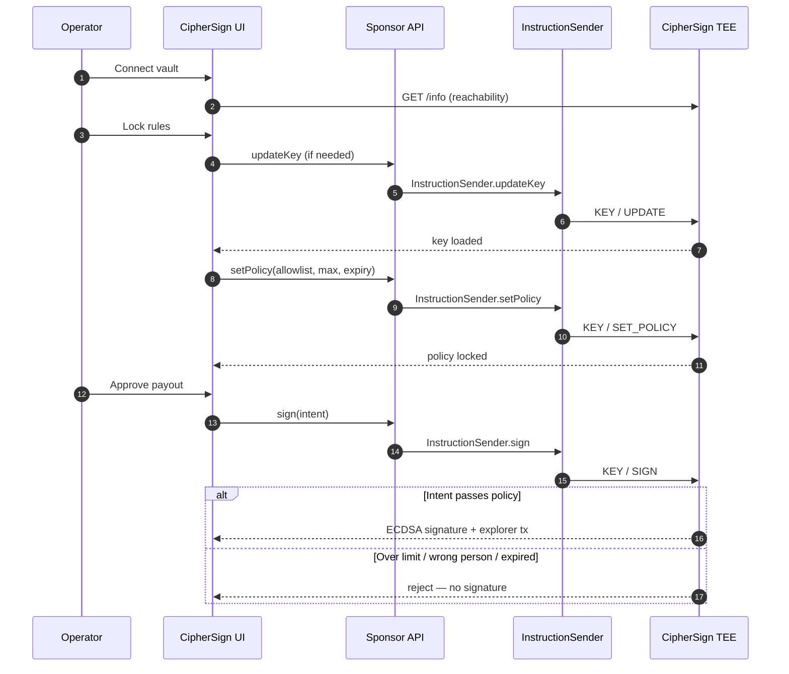

<p align="center">
  
</p>

<h1 align="center">CipherSign</h1>

<p align="center">
  <strong>Policy-gated payouts. Key stays in a Flare TEE.</strong><br/>
  Allowlist, spending limit, and expiry are enforced before any signature.
</p>

<p align="center">
  <a href="https://cipher-sign.vercel.app"></a>
  <a href="https://coston2-explorer.flare.network/address/0x23E9d227a2b1741b8e23915D7F7f592f5FEDe36A"></a>
  
  
  
  <a href="LICENSE"></a>
</p>

<p align="center">
  <a href="https://cipher-sign.vercel.app"><strong>Open live app</strong></a>
  ·
  <a href="https://coston2-explorer.flare.network/address/0x23E9d227a2b1741b8e23915D7F7f592f5FEDe36A">InstructionSender</a>
  ·
  <a href="https://coston2-explorer.flare.network/address/0x1a9C4A0f9D76c0b1D91d22E24E573a9b377618aE">FlareTeeManager</a>
</p>

---

## What it is

Hot wallets sign whatever you ask. That works for demos and drains treasuries in production.

CipherSign holds the signing key inside a **Flare Confidential Compute** TEE. Ops teams lock who can get paid and how much; every payout intent is checked **inside the enclave** before ECDSA runs.

| Rule | Blocks |
|------|--------|
| Allowlist | Wrong-person / poisoned address |
| Max amount | Overspend / script bugs |
| Expiry | Forever-valid automation keys |

Break a rule → **no signature**. The key never leaves the vault.

### Built for

| Mode | Job |
|------|-----|
| **Fee payouts** | Approved fee wallets only, under a hard cap |
| **Team payroll** | Pay approved people — never above the limit |
| **Rewards** | Partner rewards only to locked payout wallets |

---

## Use the live app

1. Open [cipher-sign.vercel.app](https://cipher-sign.vercel.app)
2. **Connect** the vault (operator TEE must be online)
3. Pick Fees / Payroll / Rewards → set allowlist + limit → **Lock rules on-chain**
4. **Approve** a payout under the rules — or try over-limit / wrong address and watch the TEE refuse

Gas for Lock / Approve is **operator-sponsored** on Coston2 (you pay $0). Explorer tx + recovered vault signer are shown in-app after a successful approval.

---

## Architecture

End-to-end path from the product UI to the attested vault:


```mermaid
flowchart TB
  subgraph Users["Ops team"]
    OPS[Finance / ops operator]
  end

  subgraph Product["CipherSign product"]
    UI["Web vault<br/>cipher-sign.vercel.app"]
    API["Sponsor API<br/>/api/instruct"]
    UI -->|Lock / Approve| API
  end

  subgraph Coston2["Flare Coston2 · chain 114"]
    SENDER["InstructionSender<br/>0x23E9…e36A"]
    DIAMOND["FlareTeeManager diamond<br/>0x1a9C…18aE"]
    API -->|updateKey · setPolicy · sign<br/>operator pays C2FLR| SENDER
    SENDER -->|getRandomTeeIds + sendInstructions| DIAMOND
  end

  subgraph FCC["Flare Confidential Compute"]
    PROXY["ext-proxy · public tunnel"]
    TEE["CipherSign TEE extension"]
    DIAMOND -.->|route to production machine| PROXY
    UI -.->|/fcc → /info · poll results| PROXY
    PROXY --> TEE

    subgraph Enclave["Enclave memory"]
      UPD["KEY / UPDATE<br/>ECIES → vault key"]
      POL["KEY / SET_POLICY<br/>allowlist · max · expiry"]
      SIGN["KEY / SIGN<br/>intent check + ECDSA"]
    end

    TEE --> UPD
    TEE --> POL
    TEE --> SIGN
  end

  OPS --> UI
  SIGN -->|policy OK| OK["ECDSA signature<br/>+ explorer proof"]
  SIGN -->|overspend / wrong addr / expired| NO["Reject — key unused"]
```

### Policy gate (inside the enclave)


```mermaid
flowchart LR
  I[SIGN intent] --> K{Key loaded?}
  K -->|no| R1[Reject]
  K -->|yes| P{Policy locked?}
  P -->|no| R2[Reject]
  P -->|yes| E{Expired?}
  E -->|yes| R3[Reject]
  E -->|no| A{Recipient<br/>allowlisted?}
  A -->|no| R4[Reject]
  A -->|yes| M{Amount ≤ max?}
  M -->|no| R5[Reject]
  M -->|yes| S[ECDSA sign]
```

### Lock → Approve sequence


```mermaid
sequenceDiagram
  autonumber
  participant Ops as Operator
  participant App as CipherSign UI
  participant API as Sponsor API
  participant Chain as InstructionSender
  participant TEE as CipherSign TEE

  Ops->>App: Connect vault
  App->>TEE: GET /info (reachability)

  Ops->>App: Lock rules
  App->>API: updateKey (if needed)
  API->>Chain: InstructionSender.updateKey
  Chain->>TEE: KEY / UPDATE
  TEE-->>App: key loaded

  App->>API: setPolicy(allowlist, max, expiry)
  API->>Chain: InstructionSender.setPolicy
  Chain->>TEE: KEY / SET_POLICY
  TEE-->>App: policy locked

  Ops->>App: Approve payout
  App->>API: sign(intent)
  API->>Chain: InstructionSender.sign
  Chain->>TEE: KEY / SIGN
  alt Intent passes policy
    TEE-->>App: ECDSA signature + explorer tx
  else Over limit / wrong person / expired
    TEE-->>App: reject — no signature
  end
```

Policy and key live in enclave memory. Restarting the TEE clears the key; the live app reloads it via sponsored `updateKey` before Lock / Approve.

Deeper design: [docs/ARCHITECTURE.md](docs/ARCHITECTURE.md) · [docs/PRODUCT.md](docs/PRODUCT.md)

---

## On-chain (Coston2)

| | |
|---|---|
| Network | Flare Testnet Coston2 (`114`) |
| InstructionSender | [`0x23E9d227a2b1741b8e23915D7F7f592f5FEDe36A`](https://coston2-explorer.flare.network/address/0x23E9d227a2b1741b8e23915D7F7f592f5FEDe36A) |
| Extension ID | `65907` (`0x…010173`) |
| FlareTeeManager | [`0x1a9C4A0f9D76c0b1D91d22E24E573a9b377618aE`](https://coston2-explorer.flare.network/address/0x1a9C4A0f9D76c0b1D91d22E24E573a9b377618aE) |

---

## Stack

| Layer | Path |
|-------|------|
| Product UI | `web/` (Vite + viem) |
| Sponsor API | `api/instruct.js` (operator pays C2FLR) |
| TEE extension | `tee/typescript/` (policy handlers) |
| Deploy / register tools | `tee/go/tools/` + `tee/scripts/` |
| Contracts | `tee/contracts/InstructionSender.sol` |

```bash
# UI (proxies /fcc → local TEE :6674)
cd web && npm ci && npm run dev

# Extension unit tests
cd tee/typescript && npm ci && npm test

# Full FCC stack (Docker) — see docs/SETUP.md
cd tee && cp .env.example .env   # fill keys
docker compose up -d
./scripts/pre-build.sh && ./scripts/post-build.sh
```

Operator runbook: [docs/SETUP.md](docs/SETUP.md) · [docs/PRODUCTION.md](docs/PRODUCTION.md)

---

## Project structure

```text
cipher-sign/
├── api/                          # Vercel serverless — sponsored InstructionSender txs
│   └── instruct.js               # updateKey · setPolicy · sign (operator pays C2FLR)
├── web/                          # Product UI
│   ├── public/                   # Brand + atmosphere assets
│   ├── scripts/                  # Operator helpers (set-extension-id)
│   └── src/
│       ├── main.ts               # Connect · Lock · Approve · proof UX
│       ├── chain.ts              # Coston2 + InstructionSender ABI
│       ├── fcc.ts                # /fcc probe + instruction result polling
│       └── verify.ts             # ECDSA recover / approval verify
├── tee/                          # Flare FCC vault stack
│   ├── contracts/                # InstructionSender (diamond-compatible)
│   ├── typescript/               # CipherSign TEE extension (policy handlers)
│   │   └── src/app/handlers.ts   # KEY/UPDATE · SET_POLICY · SIGN
│   ├── go/
│   │   ├── internal/             # Go extension runtime
│   │   └── tools/                # Deploy, register, diagnose, e2e test
│   ├── proxy/                    # ext-proxy Docker image
│   ├── scripts/                  # pre-build · post-build · compose helpers
│   ├── config/coston2/           # FlareTeeManager deployed addresses
│   └── docker-compose.yaml       # redis + ext-proxy + extension-tee
├── scripts/                      # Repo ops (Vercel sponsor env)
├── docs/                         # Product, architecture, setup, production
├── vercel.json                   # Web build + /fcc rewrite to live TEE tunnel
└── README.md
```

Product path: **`web/` + `api/` + `tee/typescript/` + `tee/contracts/`**.  
`tee/go/tools` is for deploy/register against FlareTeeManager.

---

## Roadmap

**Shipped.** Live Coston2 vault: policy lives in the TEE, Lock/Approve are on-chain, gas is sponsored, proofs verify in-app.

**Next — make it operational.** Survive TEE restarts without re-seeding keys; replace ephemeral tunnels with a fixed FCC endpoint; run under hardware attestation so “live” means Confidential Space, not a laptop. Until then, CipherSign is a working control plane — not yet a set-and-forget treasury rail.

**Then — close the money loop.** Mainnet Flare, optional settle-after-sign, and a thin automation API so fee bots and payroll jobs call the same gate humans use. Everything else (dashboards, template packs) only matters after the vault is durable and attested.

---

## License

MIT — [LICENSE](LICENSE). Upstream FCC components © Flare Foundation.
